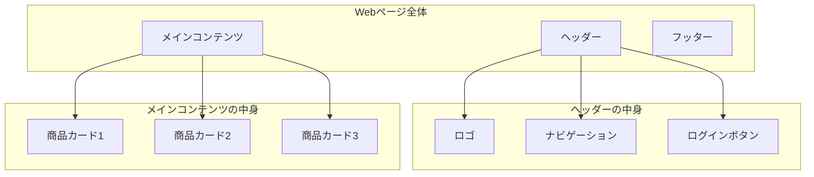
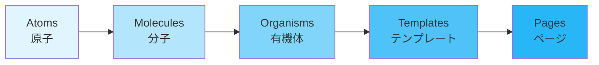
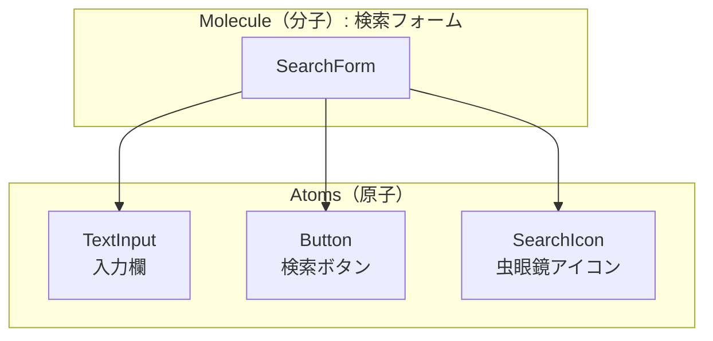
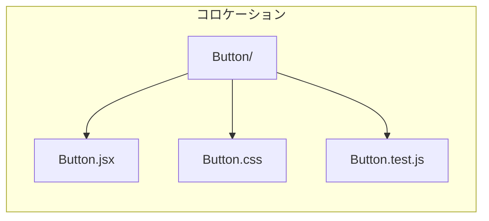
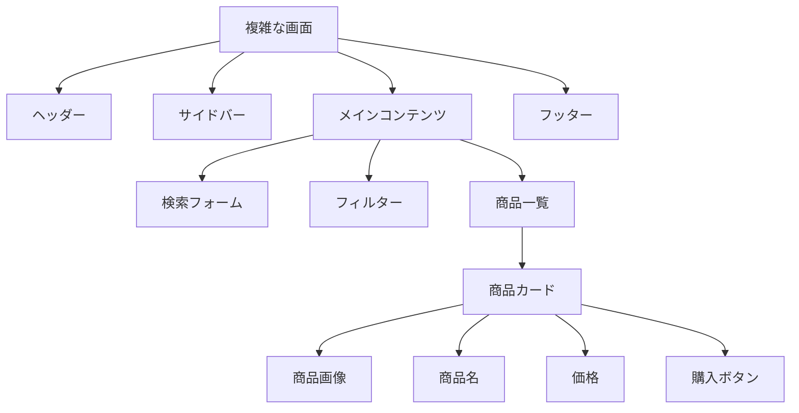
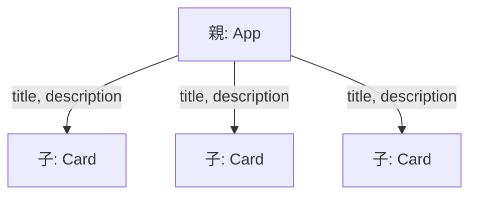

# コンポーネント設計

## はじめに

この資料では、フロントエンド開発における「コンポーネント設計」について学びます。

## コンポーネントとは何か

**コンポーネント（Component）** とは、画面を構成する「部品」のことです。

たとえば、あなたが毎日使っているWebサイトを思い浮かべてください。

- ヘッダー（画面上部のロゴやメニュー）
- ボタン
- 入力フォーム
- カード（商品情報などがまとまった枠）
- フッター（画面下部の著作権表示など）

これらひとつひとつが「コンポーネント」です。

### 身近な例

コンポーネントは「レゴブロック」に似ています。

- レゴブロックは、小さなパーツを組み合わせて大きな作品を作ります
- コンポーネントも、小さな部品を組み合わせて画面を作ります
- 一度作ったパーツは、別の場所でも再利用できます



## なぜコンポーネント設計が大切なのか

### 1. 再利用できる

同じボタンを10箇所で使いたいとき、毎回ゼロから書く必要がありません。一度作ったコンポーネントを使い回せます。

### 2. 修正が簡単になる

ボタンのデザインを変更したいとき、コンポーネントを1箇所直すだけで、使っている10箇所すべてに反映されます。

### 3. チームで分担しやすい

「Aさんはヘッダーを担当」「Bさんはカードを担当」というように、作業を分けやすくなります。

### 4. テストしやすい

小さな部品ごとに動作確認ができるので、バグ（不具合）を見つけやすくなります。

## 実際のコンポーネントを見てみよう

### シンプルなボタンコンポーネント

```jsx
// Button.jsx - ボタンのコンポーネント

function Button({ text, onClick }) {
  return (
    <button onClick={onClick}>
      {text}
    </button>
  );
}

export default Button;
```

**コードの解説**
- `function Button` → 「Button」という名前のコンポーネントを作っています
- `{ text, onClick }` → 外から受け取る情報（プロパティ）です
  - `text`：ボタンに表示する文字
  - `onClick`：ボタンが押されたときに実行する処理
- `return (...)` → 実際に画面に表示する内容を返しています

### ボタンを使ってみる

```jsx
// App.jsx - メインの画面

import Button from './Button';

function App() {
  const handleClick = () => {
    alert('ボタンが押されました！');
  };

  return (
    <div>
      <h1>ボタンのテスト</h1>
      <Button text="クリックしてね" onClick={handleClick} />
      <Button text="もうひとつのボタン" onClick={handleClick} />
    </div>
  );
}

export default App;
```

同じ `Button` コンポーネントを2回使っていますが、表示する文字（`text`）を変えることで、違うボタンとして表示できます。

## Atomic Design（アトミックデザイン）を理解する

**Atomic Design（アトミックデザイン）** は、コンポーネントを5つの段階に分けて整理する考え方です。

> **注意**
> Atomic Designは元々「デザインの原則」として生まれたものです。開発の設計にそのまま当てはめると、かえって複雑になることもあります。「こういう考え方がある」と知っておき、プロジェクトに合わせて柔軟に取り入れましょう。

### 5つの段階



| 段階 | 英語名 | 説明 | 例 |
|------|--------|------|-----|
| 原子 | Atoms | これ以上分割できない最小の部品 | ボタン、入力欄、ラベル、アイコン |
| 分子 | Molecules | 原子を組み合わせた小さなグループ | 検索フォーム（入力欄 + ボタン） |
| 有機体 | Organisms | 分子や原子を組み合わせた大きなセクション | ヘッダー、商品カード一覧 |
| テンプレート | Templates | ページの骨格（データなし） | ブログ記事ページの枠組み |
| ページ | Pages | テンプレートに実際のデータを入れたもの | 実際のブログ記事ページ |

### 具体例：検索フォームの分解



### Atomic Design の注意点

1. **厳密に分類しすぎない**
   - 「これはMoleculesかOrganismsか？」と悩みすぎると、開発が進まなくなります
   - チームで「だいたいこのくらい」と基準を決めておくとよいでしょう

2. **プロジェクトに合わせてカスタマイズする**
   - 5段階すべてを使う必要はありません
   - 小規模なプロジェクトなら「atoms / components / pages」の3段階でも十分です

3. **コードの整理方法のひとつとして捉える**
   - 「どこに何があるかわかりやすくする」ことが目的です
   - ルールに縛られすぎず、チームが使いやすい形にしましょう


## コロケーション（Colocation）を理解する

**コロケーション** とは、「関連するファイルを近くに置く」という整理方法です。

> **用語解説：コロケーション（Colocation）**
> 「Co（一緒に）」+「Location（場所）」で、「同じ場所に置く」という意味です。

### コロケーションの整理方法（関連ファイルを近くに置く）

```
src/
└── components/
    ├── Header/
    │   ├── Header.jsx       ← コンポーネント本体
    │   ├── Header.css       ← スタイル
    │   ├── Header.test.js   ← テスト
    │   └── index.js         ← 外部への公開用
    ├── Button/
    │   ├── Button.jsx
    │   ├── Button.css
    │   ├── Button.test.js
    │   └── index.js
    └── Card/
        ├── Card.jsx
        ├── Card.css
        ├── Card.test.js
        └── index.js
```

この方法のメリット
- `Button`に関するファイルがすべて同じフォルダにある
- 修正・削除するときに、関連ファイルを見つけやすい
- 不要になったら、フォルダごと削除できる

### コロケーションの図解



## よくある設計のヒント

### 1. 「困難は分割せよ」

複雑な画面を作るときは、まず小さな部品に分けて考えましょう。



### 2. ひとつのコンポーネントには「ひとつの役割」

- 良い例：`Button`（ボタンを表示する）
- 悪い例：`ButtonAndFormAndValidation`（いろいろやりすぎ）

### 3. 親から子へデータを渡す

Reactでは、データは基本的に「親コンポーネント → 子コンポーネント」へ流れます。



### 4. 共通で使うものは汎用的に作る

たとえば`Button`は、色やサイズを外から指定できるようにしておくと、さまざまな場面で使えます。

```jsx
// 汎用的なボタン
function Button({ text, variant = 'primary', size = 'medium', onClick }) {
  return (
    <button
      className={`btn btn-${variant} btn-${size}`}
      onClick={onClick}
    >
      {text}
    </button>
  );
}

// 使用例
<Button text="送信" variant="primary" size="large" />
<Button text="キャンセル" variant="secondary" size="medium" />
<Button text="削除" variant="danger" size="small" />
```

## まとめ

| 概念 | ポイント |
|------|----------|
| コンポーネント | 画面を構成する「部品」。再利用できる |
| Atomic Design | コンポーネントを5段階で整理する考え方。柔軟に取り入れる |
| コロケーション | 関連ファイルを同じ場所に置く整理方法 |

コンポーネント設計の基本は「**分けて、組み合わせる**」ことです。

最初から完璧な設計を目指す必要はありません。まずは動くものを作り、必要に応じてリファクタリング（コードの整理）していきましょう。


## 参考資料

### 公式ドキュメント

- [React 公式ドキュメント - コンポーネントと Props](https://ja.react.dev/learn/passing-props-to-a-component)
- [React 公式ドキュメント - コンポーネントを純粋に保つ](https://ja.react.dev/learn/keeping-components-pure)

### Atomic Design

- [Atomic Design by Brad Frost（原著・英語）](https://atomicdesign.bradfrost.com/)

### コロケーション

- [Colocation - Kent C. Dodds（英語）](https://kentcdodds.com/blog/colocation)

### 参考記事

- [【React】「困難は分割せよ」―― 複雑な画面は小さな機能に分けて実装しよう。](https://qiita.com/honey32/items/2e6206c7dc1974b9bf9a)
- [【React】Context を使う前に #1 無駄なコンポーネントの層を削れ](https://qiita.com/honey32/items/b9f70f960e891f031b0f)
- [【React】Context を使う前に #2 コンポジション (ReactNode 型の Props) を使え](https://qiita.com/honey32/items/4d04e454550fb1ed922c)
