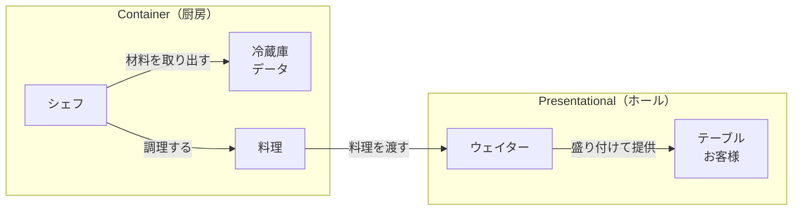
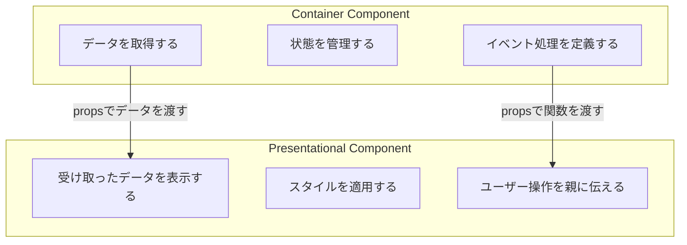
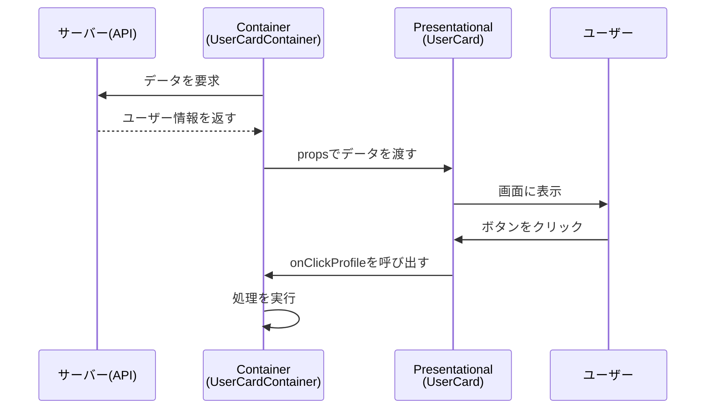
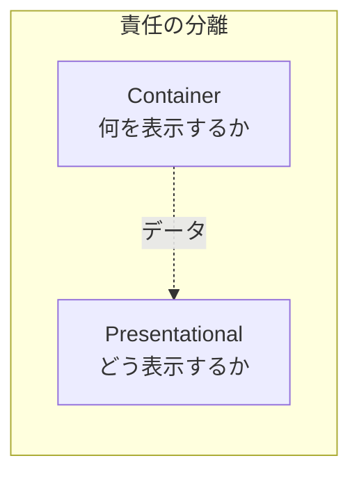
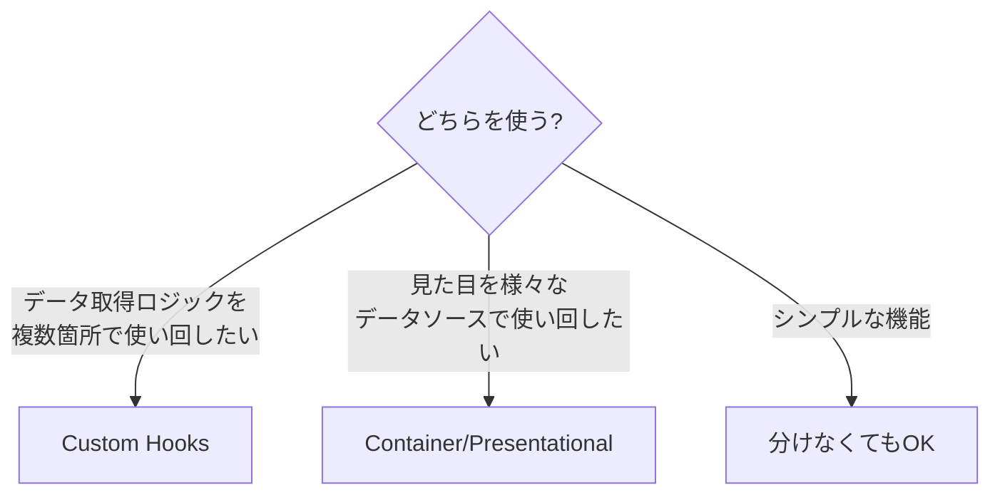

# Container/Presentationalパターンを理解しよう

## はじめに

この資料では、Reactでよく使われる設計パターンのひとつ「**Container/Presentationalパターン**」について学びます。

このパターンを理解すると、コードが整理され、読みやすく・修正しやすいコンポーネントが作れるようになります。

## Container/Presentationalパターンとは

**Container/Presentationalパターン** は、コンポーネントの役割を2つに分ける考え方です。

| 種類 | 日本語訳 | 役割 |
|------|----------|------|
| **Container**（コンテナ） | 入れ物 | データの取得・管理を担当 |
| **Presentational**（プレゼンテーショナル） | 見た目 | 画面への表示を担当 |

### 身近な例

このパターンは、レストランの仕組みに例えるとわかりやすいです。



- **厨房（Container）**：材料（データ）を冷蔵庫から取り出し、調理（処理）する
- **ホール（Presentational）**：できた料理を受け取り、きれいに盛り付けてお客様に見せる

それぞれが自分の仕事に集中することで、効率的に回ります。

## Container/Presentationalパターンの解説

### 2種類のコンポーネント



### Presentational Component（見た目担当）

**特徴**
- 「どう見えるか」だけを担当します
- データはすべて親コンポーネントから `props` で受け取ります
- 自分でデータを取得したり、複雑な計算をしたりしません
- 見た目（CSS）に関するコードを持ちます

**コード例**

```jsx
// UserCard.jsx - Presentational Component
// 見た目だけを担当する「純粋な」コンポーネント

import './UserCard.css';

function UserCard({ name, email, avatarUrl, onClickProfile }) {
  return (
    <div className="user-card">
      
      <div className="user-card__info">
        <h3 className="user-card__name">{name}</h3>
        <p className="user-card__email">{email}</p>
      </div>
      <button
        className="user-card__button"
        onClick={onClickProfile}
      >
        プロフィールを見る
      </button>
    </div>
  );
}

export default UserCard;
```

このコンポーネントは
- `name`、`email`、`avatarUrl` というデータを受け取って表示するだけ
- `onClickProfile` というボタン押下時の処理も、外から受け取る
- 自分では「どのユーザーを表示するか」を知らない

### Container Component（データ担当）

**特徴**
- 「何のデータを使うか」を担当します
- API（サーバー）からデータを取得します
- 状態（state）を管理します
- 見た目のコード（CSS）は持ちません
- Presentational Componentにデータを渡します

**コード例**

```jsx
// UserCardContainer.jsx - Container Component
// データの取得と管理を担当するコンポーネント

import { useState, useEffect } from 'react';
import UserCard from './UserCard';

function UserCardContainer({ userId }) {
  // 状態を管理する
  const [user, setUser] = useState(null);
  const [isLoading, setIsLoading] = useState(true);
  const [error, setError] = useState(null);

  // データを取得する
  useEffect(() => {
    const fetchUser = async () => {
      try {
        setIsLoading(true);
        const response = await fetch(`/api/users/${userId}`);
        const data = await response.json();
        setUser(data);
      } catch (err) {
        setError('ユーザー情報の取得に失敗しました');
      } finally {
        setIsLoading(false);
      }
    };

    fetchUser();
  }, [userId]);

  // イベント処理を定義する
  const handleClickProfile = () => {
    console.log(`${user.name}のプロフィールページへ移動`);
    // 実際にはページ遷移の処理など
  };

  // 状態に応じて表示を切り替える
  if (isLoading) {
    return <div>読み込み中...</div>;
  }

  if (error) {
    return <div>{error}</div>;
  }

  // Presentational Componentにデータを渡す
  return (
    <UserCard
      name={user.name}
      email={user.email}
      avatarUrl={user.avatarUrl}
      onClickProfile={handleClickProfile}
    />
  );
}

export default UserCardContainer;
```

このコンポーネントは
- APIからユーザーデータを取得する
- 読み込み中・エラー・成功の状態を管理する
- 取得したデータを `UserCard` に渡す
- 自分では見た目を一切定義しない

### データの流れ



---

## Container/Presentationalパターンのメリット

### 1. 役割が明確になる



「このコンポーネントは何をしているのか」がすぐにわかります。

- Containerを見れば → データの流れがわかる
- Presentationalを見れば → 見た目がわかる

### 2. 再利用しやすい

Presentational Componentは、データをもらって表示するだけなので、別の場所でも使い回せます。

```jsx
// 同じUserCardを、違うContainerから使える

// 管理画面用
<AdminUserCardContainer userId={123} />

// 一般ユーザー用
<PublicUserCardContainer userId={456} />

// どちらも内部では同じUserCardを使っている
```

### 3. テストしやすい

**Presentational Componentのテスト**
- 「このデータを渡したら、こう表示される」を確認するだけ
- サーバーとの通信を考えなくていい

**Container Componentのテスト**
- 「このAPIを呼んだら、このデータが返る」を確認
- 見た目のことは考えなくていい

## Container/Presentationalパターンのデメリット

### 1. ファイル数が増える

ひとつの機能を作るのに、最低2つのファイルが必要になります。

```
components/
└── UserCard/
    ├── UserCard.jsx           # Presentational
    ├── UserCardContainer.jsx  # Container
    ├── UserCard.css
    └── index.js
```

小さなアプリでは、かえって複雑に感じることがあります。

### 2. 過度な分離は逆効果

「とにかく分ければいい」と考えすぎると
- シンプルな機能まで2つに分けてしまう
- コードを追うのが大変になる
- 開発スピードが落ちる

## 現代のReactでの考え方

### React Hooksの登場

2019年にReact Hooks（フックス）が導入されてから、このパターンの使い方が変わってきました。

### Custom Hooks（カスタムフック）による代替

データ取得のロジックを「カスタムフック」として切り出す方法が一般的になっています。

```jsx
// hooks/useUsers.js - カスタムフック

import { useState, useEffect } from 'react';

function useUsers() {
  const [users, setUsers] = useState([]);
  const [isLoading, setIsLoading] = useState(true);
  const [error, setError] = useState(null);

  useEffect(() => {
    const fetchUsers = async () => {
      try {
        const response = await fetch('/api/users');
        const data = await response.json();
        setUsers(data);
      } catch (err) {
        setError('取得に失敗しました');
      } finally {
        setIsLoading(false);
      }
    };

    fetchUsers();
  }, []);

  return { users, isLoading, error };
}

export default useUsers;
```

```jsx
// components/UserList.jsx - カスタムフックを使う

import useUsers from '../hooks/useUsers';

function UserList() {
  const { users, isLoading, error } = useUsers();

  if (isLoading) return <div>読み込み中...</div>;
  if (error) return <div>{error}</div>;

  return (
    <ul>
      {users.map((user) => (
        <li key={user.id}>{user.name}</li>
      ))}
    </ul>
  );
}
```

### どちらを使うべきか



**Container/Presentationalパターンが向いている場合**
- 同じ見た目を、異なるデータソースで使いたい
- デザインチームと分業したい
- レガシーコード（古いコード）を段階的に改善したい

**Custom Hooksが向いている場合**
- データ取得ロジックを使い回したい
- コンポーネントの数を減らしたい
- よりシンプルな構成にしたい


## パターン提唱者からのメッセージ

このパターンを広めたDan Abramov（ダン・アブラモフ、Reactの開発チームメンバー）は、2019年に次のように述べています。

> 「このパターンは有用だが、Hooksがあれば必須ではない。状況に応じて使い分けよう」

つまり、「絶対にこう書かなければならない」というルールではなく、**チームやプロジェクトに合わせて柔軟に使う**ことが大切です。

---

## まとめ

| 項目 | Container | Presentational |
|------|-----------|----------------|
| 役割 | データの取得・管理 | 画面への表示 |
| 状態（state） | 持つ | 持たない（基本） |
| props | 子に渡す | 親から受け取る |
| スタイル | 持たない | 持つ |
| 再利用性 | 低い | 高い |

**覚えておきたいポイント：**

1. **分離の目的**：「何を表示するか」と「どう表示するか」を分ける
2. **メリット**：再利用性・テスト容易性・可読性の向上
3. **デメリット**：ファイル数増加・過度な分離は逆効果
4. **現代では**：Custom Hooksという選択肢もある
5. **大切なこと**：ルールに縛られず、状況に応じて使い分ける

---

## 参考資料

### 公式ドキュメント

- [React 公式ドキュメント - カスタムフックでロジックを再利用する](https://ja.react.dev/learn/reusing-logic-with-custom-hooks)
- [React 公式ドキュメント - state の管理](https://ja.react.dev/learn/managing-state)

### パターン提唱者の記事

- [Presentational and Container Components - Dan Abramov（英語）](https://medium.com/@dan_abramov/smart-and-dumb-components-7ca2f9a7c7d0)
  - ※ 記事内で「このパターンはもう推奨しない」という追記がありますが、パターン自体の理解には有用です

### 設計パターン全般

- [patterns.dev - Container/Presentational Pattern（英語）](https://www.patterns.dev/react/presentational-container-pattern/)
