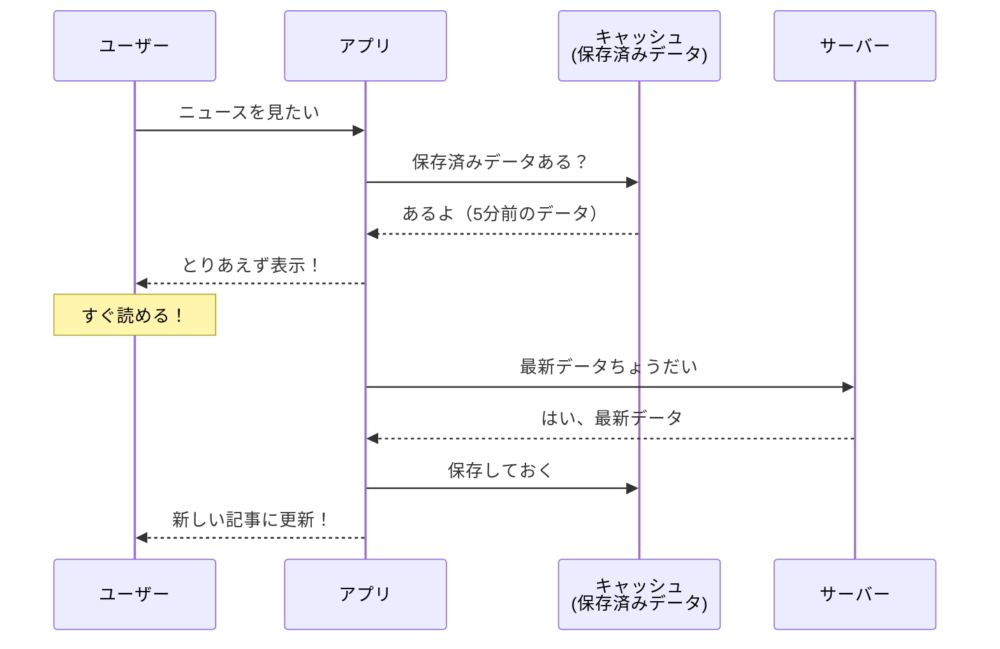
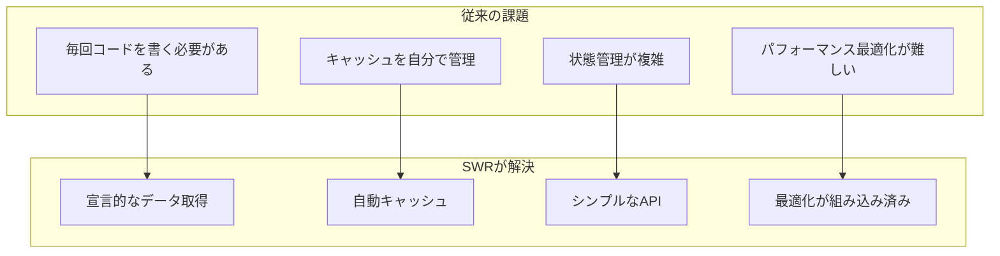

# SWRを理解しよう

## はじめに

この資料では、Reactでデータを取得するためのライブラリ「**SWR**」について学びます。

SWRを使うと、サーバーからのデータ取得がシンプルに書け、さらに高速で快適なユーザー体験を実現できます。

## SWRとは

**SWR** は、Vercel社（Next.jsの開発元）が作った、Reactでデータを取得するためのライブラリです。

### 名前の由来

SWRは「**S**tale-**W**hile-**R**evalidate」の頭文字を取った名前です。

| 単語 | 意味 |
|------|------|
| Stale | 古い、新鮮でない |
| While | ～している間 |
| Revalidate | 再検証する、最新かどうか確認する |

つまり「**古いデータを表示しながら、裏で最新データを取得する**」という戦略を表しています。

### 身近な例 ニュースアプリ



**従来の方法**
1. サーバーにデータを要求
2. 待つ...（数秒かかることも）
3. やっとデータが表示される

**SWRの方法**
1. まず保存済みのデータを表示（即座に）
2. 裏で最新データを取得
3. 取得できたら自動で更新

ユーザーは待ち時間をほとんど感じません。

## 従来の方法との比較

### useEffect + useState で書く場合

```jsx
import { useState, useEffect } from 'react';

function UserProfile() {
  const [data, setData] = useState(null);
  const [error, setError] = useState(null);
  const [isLoading, setIsLoading] = useState(true);

  useEffect(() => {
    const fetchData = async () => {
      try {
        const response = await fetch('/api/user');
        const result = await response.json();
        setData(result);
      } catch (err) {
        setError(err);
      } finally {
        setIsLoading(false);
      }
    };

    fetchData();
  }, []);

  if (isLoading) return <div>読み込み中...</div>;
  if (error) return <div>エラーが発生しました</div>;
  return <div>こんにちは、{data.name}さん！</div>;
}
```

### SWRで書く場合

```jsx
import useSWR from 'swr';

const fetcher = (url) => fetch(url).then((res) => res.json());

function UserProfile() {
  const { data, error, isLoading } = useSWR('/api/user', fetcher);

  if (isLoading) return <div>読み込み中...</div>;
  if (error) return <div>エラーが発生しました</div>;
  return <div>こんにちは、{data.name}さん！</div>;
}
```

### 比較表

| 項目 | useEffect + useState | SWR |
|------|---------------------|-----|
| コード量 | 多い（20行以上） | 少ない（10行程度） |
| キャッシュ | 自分で実装が必要 | 自動 |
| 再取得 | 自分で実装が必要 | 自動（フォーカス時など） |
| エラー処理 | 自分で書く | 組み込み済み |
| 読み込み状態 | 自分で管理 | 自動 |

## SWRのメリット

### 1. コードがシンプルになる

データ取得に必要なコードが大幅に減ります。


### 2. 自動でキャッシュしてくれる

同じデータを複数の場所で使っても、サーバーへのリクエストは1回だけです。

```jsx
// ヘッダーでユーザー情報を表示
function Header() {
  const { data } = useSWR('/api/user', fetcher);
  return <div>ログイン中: {data?.name}</div>;
}

// プロフィールページでも同じユーザー情報を表示
function ProfilePage() {
  const { data } = useSWR('/api/user', fetcher);
  return <div>名前: {data?.name}</div>;
}

// 両方が同時に表示されても、APIへのリクエストは1回だけ！
```

### 3. 自動で最新データを取得してくれる

以下のタイミングで自動的にデータを再取得します。

| タイミング | 説明 |
|-----------|------|
| ページにフォーカス | 別のタブから戻ってきたとき |
| ネットワーク復帰 | オフラインからオンラインになったとき |
| 一定間隔 | 設定した時間ごと（オプション） |

```jsx
// 3秒ごとに自動更新
const { data } = useSWR('/api/stock-price', fetcher, {
  refreshInterval: 3000,
});
```

### 4. 楽観的UI（Optimistic UI）が簡単

> **楽観的UI**
> 「たぶん成功するだろう」と楽観的に考えて、サーバーからの応答を待たずに画面を先に更新する手法です。失敗したら元に戻します。

```jsx
import useSWR, { mutate } from 'swr';

function TodoList() {
  const { data: todos } = useSWR('/api/todos', fetcher);

  const addTodo = async (newTodo) => {
    // 1. 画面を先に更新（楽観的更新）
    mutate('/api/todos', [...todos, newTodo], false);

    // 2. サーバーに送信
    await fetch('/api/todos', {
      method: 'POST',
      body: JSON.stringify(newTodo),
    });

    // 3. サーバーの最新データで確認
    mutate('/api/todos');
  };

  return (/* ... */);
}
```

### 5. エラー時の再試行が自動

ネットワークエラーなどが発生しても、自動で再試行してくれます。

## SWRのデメリット

### 1. 学習コストがある

SWR独自の概念（キャッシュキー、mutateなど）を理解する必要があります。

```jsx
// キャッシュキーの概念
useSWR('/api/user/1', fetcher);  // キー: '/api/user/1'
useSWR('/api/user/2', fetcher);  // キー: '/api/user/2'（別のデータ）
useSWR('/api/user/1', fetcher);  // キー: '/api/user/1'（最初と同じキャッシュ）
```

### 2. 複雑なデータ操作には向かない場合も

シンプルなデータ取得には最適ですが、以下のような場合は別のライブラリも検討が必要です。

- 複雑なデータの正規化が必要（→ TanStack Query / Apollo Client）
- GraphQLを使いたい（→ Apollo Client / urql）

### 3. バンドルサイズが増える

SWRを追加すると、アプリのファイルサイズが少し増えます。

> **バンドルサイズ**
> ブラウザがダウンロードするファイルの大きさです。大きすぎると、ページの表示が遅くなります。

### 4. SSR/SSGとの組み合わせに注意が必要

> **SSR（サーバーサイドレンダリング）**
> サーバー側でHTMLを生成してからブラウザに送る方式です。

> **SSG（静的サイト生成）**
> ビルド時にHTMLを生成しておく方式です。

Next.jsなどでSSR/SSGと組み合わせる場合、初期データの渡し方に注意が必要です。

```jsx
// Next.jsでの例
export async function getServerSideProps() {
  const user = await fetchUser();
  return { props: { fallback: { '/api/user': user } } };
}

function App({ fallback }) {
  return (
    <SWRConfig value={{ fallback }}>
      <UserProfile />
    </SWRConfig>
  );
}
```

## SWRが生まれた背景

### 従来のデータ取得の課題



### HTTP Cache-Control ヘッダーからの着想

SWRの名前は、HTTPの `Cache-Control` ヘッダーにある `stale-while-revalidate` ディレクティブから来ています。

これはウェブ標準の仕様で、「古いキャッシュを使いながら、裏で新しいデータを取りに行く」という考え方です。

```
Cache-Control: max-age=60, stale-while-revalidate=300
```

この仕組みをReactのデータ取得に応用したのがSWRです。


## まとめ

| 項目 | 内容 |
|------|------|
| SWRとは | Reactのデータ取得ライブラリ |
| 名前の意味 | Stale-While-Revalidate（古いデータを表示しながら再取得） |
| 主なメリット | コード削減、自動キャッシュ、自動再取得 |
| 主なデメリット | 学習コスト、複雑な操作には不向きな場合も |
| 適した場面 | REST API、シンプルなアプリ、Next.jsプロジェクト |

## 参考資料

### 公式ドキュメント

- [SWR 公式ドキュメント（日本語）](https://swr.vercel.app/ja)
- [SWR GitHub リポジトリ](https://github.com/vercel/swr)

### HTTP仕様

- [MDN Web Docs - Cache-Control](https://developer.mozilla.org/ja/docs/Web/HTTP/Headers/Cache-Control)
- [RFC 5861 - HTTP Cache-Control Extensions for Stale Content](https://datatracker.ietf.org/doc/html/rfc5861)
