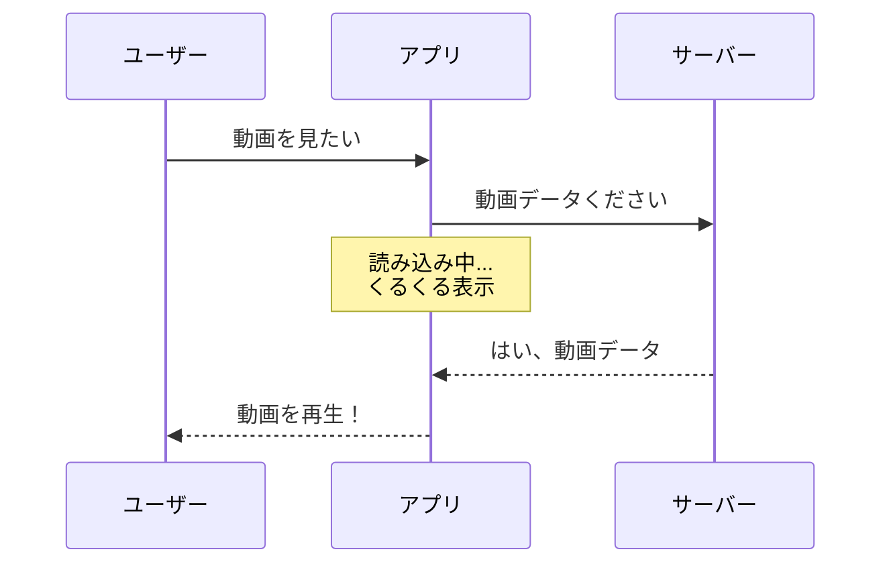
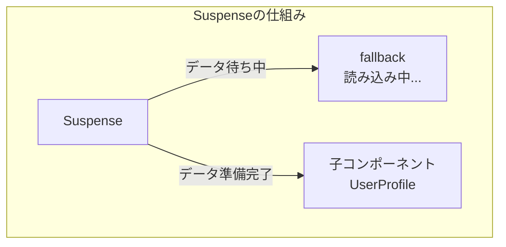
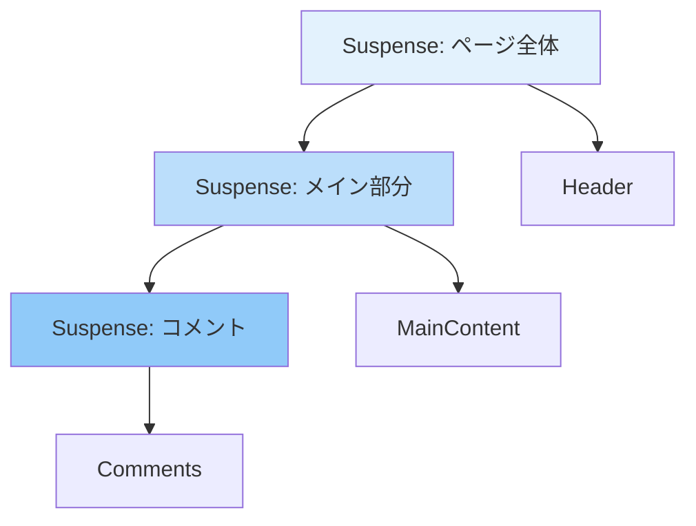
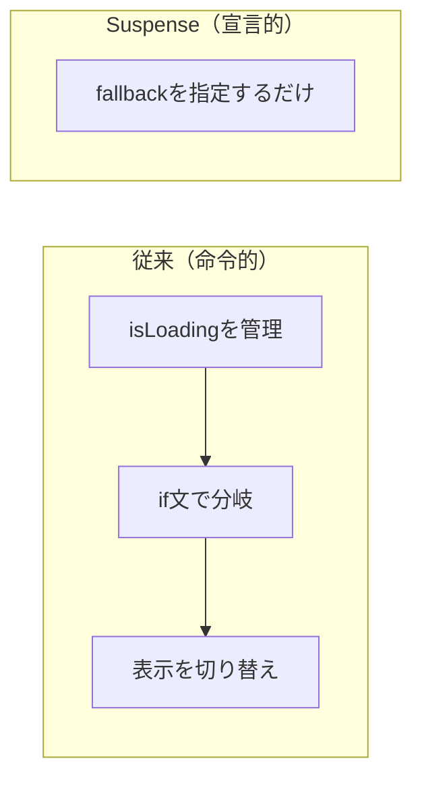
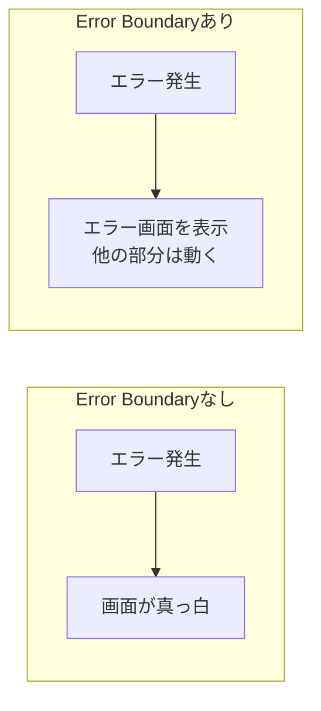
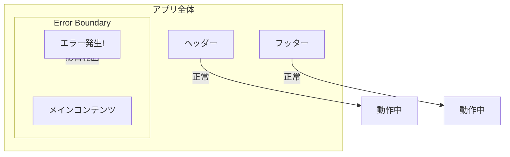

# Suspenseを理解しよう

## はじめに

この資料では、Reactの機能である「Suspense」と「Error Boundary」について学びます。

これらを使うと、データの読み込み中やエラー発生時の表示をスッキリ書けるようになります。

## Suspenseとは

Suspense（サスペンス） は、「何かを待っている間、代わりの画面を表示する」ための仕組みです。

### 身近な例

動画サイトで動画を再生しようとしたとき、こんな画面を見たことがありませんか？



この「くるくる表示」が Suspense の役割です。

## Suspenseの解説

### 従来の書き方の問題

Suspense を使わない場合、読み込み中の表示を自分で書く必要があります。

```jsx
function UserProfile() {
  const [user, setUser] = useState(null);
  const [isLoading, setIsLoading] = useState(true);

  useEffect(() => {
    fetchUser().then((data) => {
      setUser(data);
      setIsLoading(false);
    });
  }, []);

  // 毎回この条件分岐を書く必要がある
  if (isLoading) {
    return <div>読み込み中...</div>;
  }

  return <div>{user.name}</div>;
}
```

問題点
- 読み込み状態を管理する変数（`isLoading`）が必要
- コンポーネントごとに条件分岐を書く
- コードが複雑になりがち

### Suspenseを使うとどうなるか

```jsx
import { Suspense } from 'react';

function App() {
  return (
    <Suspense fallback={<div>読み込み中...</div>}>
      <UserProfile />
    </Suspense>
  );
}
```

Suspense は「このコンポーネントがデータを待っていたら、代わりに `fallback` を表示してね」と宣言するだけです。

> fallback（フォールバック）：
> 「代替品」「予備」という意味です。本来表示したいものが準備できていないときに、代わりに表示するものを指します。

### 図で理解する Suspense



## Suspenseの基本的な使い方

### 1. 遅延読み込み（Lazy Loading）との組み合わせ

最も一般的な使い方は、コンポーネントの遅延読み込みです。

> 遅延読み込み（Lazy Loading）：
> 「必要になったときに読み込む」という手法です。最初にすべてを読み込まず、使うタイミングで読み込むことで、初期表示を速くできます。

```jsx
import { Suspense, lazy } from 'react';

// 遅延読み込みするコンポーネント
const HeavyChart = lazy(() => import('./HeavyChart'));
const UserSettings = lazy(() => import('./UserSettings'));

function App() {
  return (
    <div>
      <h1>ダッシュボード</h1>

      {/* チャートが読み込まれるまで「グラフを準備中...」を表示 */}
      <Suspense fallback={<div>グラフを準備中...</div>}>
        <HeavyChart />
      </Suspense>

      {/* 設定画面が読み込まれるまで「設定を読み込み中...」を表示 */}
      <Suspense fallback={<div>設定を読み込み中...</div>}>
        <UserSettings />
      </Suspense>
    </div>
  );
}
```

### 2. データ取得との組み合わせ（React 18以降）

React 18からは、データ取得ライブラリと組み合わせて使えます。

```jsx
import { Suspense } from 'react';
import { fetchUserData } from './api';

// データ取得を「サスペンド」できるコンポーネント
function UserProfile({ userId }) {
  // SWR、React Query、Relayなどが対応
  const user = use(fetchUserData(userId));
  return <div>{user.name}</div>;
}

function App() {
  return (
    <Suspense fallback={<LoadingSpinner />}>
      <UserProfile userId={1} />
    </Suspense>
  );
}
```

### 3. ネスト（入れ子）にする

Suspense は入れ子にできます。

```jsx
function App() {
  return (
    <Suspense fallback={<div>ページ全体を読み込み中...</div>}>
      <Header />

      <Suspense fallback={<div>メイン部分を読み込み中...</div>}>
        <MainContent />

        <Suspense fallback={<div>コメントを読み込み中...</div>}>
          <Comments />
        </Suspense>
      </Suspense>
    </Suspense>
  );
}
```



外側から順番にフォールバックが表示され、準備ができた部分から実際のコンテンツに切り替わります。

## Suspenseのメリット

### 1. 宣言的に書ける

「読み込み中はこれを表示する」と宣言するだけで済みます。



> 宣言的（Declarative）：
> 「こうあってほしい」という結果を書くスタイルです。「どうやって実現するか」は書かなくてよく、コードが読みやすくなります。

### 2. 読み込み状態を一箇所で管理できる

複数のコンポーネントの読み込み状態を、ひとつの Suspense でまとめられます。

```jsx
// 3つのコンポーネントが全部準備できるまで待つ
<Suspense fallback={<div>読み込み中...</div>}>
  <UserInfo />
  <UserPosts />
  <UserFriends />
</Suspense>
```

### 3. ユーザー体験の向上

読み込み中も画面が真っ白にならず、何かしらのフィードバックを表示できます。

### 4. コンポーネントの責任分離

- Suspense：待機状態の表示を担当
- 子コンポーネント：データの表示を担当

それぞれが自分の役割に集中できます。

## Error Boundaryの解説

### Error Boundaryとは

Error Boundary（エラーバウンダリ） は、「エラーが発生したときに、代わりの画面を表示する」ための仕組みです。

### なぜ必要なのか

JavaScriptでエラーが発生すると、通常は画面全体が真っ白になってしまいます。



Error Boundary を使うと、エラーが発生した部分だけを差し替え、他の部分は正常に動作させられます。

> **補足**
> Error Boundary は React の仕様上、クラスコンポーネントでしか実装できません。しかし、自分でクラスを書く必要はなく、`react-error-boundary` というライブラリを使えば、関数コンポーネントだけで簡単に使えます。

## react-error-boundary の使い方

### 基本的な使い方

```jsx
import { ErrorBoundary } from 'react-error-boundary';

// エラー時に表示するコンポーネント
function ErrorFallback({ error, resetErrorBoundary }) {
  return (
    <div className="error-fallback">
      <h2>問題が発生しました</h2>
      <p>{error.message}</p>
      <button onClick={resetErrorBoundary}>再試行</button>
    </div>
  );
}

function App() {
  return (
    <ErrorBoundary FallbackComponent={ErrorFallback}>
      <MyComponent />
    </ErrorBoundary>
  );
}
```

**コードの解説：**

| コード | 意味 |
|--------|------|
| `ErrorBoundary` | エラーをキャッチする境界線 |
| `FallbackComponent` | エラー時に表示するコンポーネント |
| `error` | 発生したエラーの情報 |
| `resetErrorBoundary` | エラー状態をリセットする関数 |

### エラーの影響範囲を限定する

Error Boundary で囲んだ部分だけがエラーの影響を受けます。

```jsx
function App() {
  return (
    <div>
      <Header />  {/* ここはエラーの影響を受けない */}

      <ErrorBoundary FallbackComponent={ErrorFallback}>
        <MainContent />  {/* エラーが起きてもここだけ差し替わる */}
      </ErrorBoundary>

      <Footer />  {/* ここもエラーの影響を受けない */}
    </div>
  );
}
```



### リセット時に処理を実行する

`onReset` を使うと、再試行ボタンが押されたときに追加の処理を実行できます。

```jsx
function App() {
  return (
    <ErrorBoundary
      FallbackComponent={ErrorFallback}
      onReset={() => {
        // データの再取得など、必要な処理を実行
        console.log('エラーをリセットしました');
      }}
    >
      <MyComponent />
    </ErrorBoundary>
  );
}
```

### エラー情報を外部に送信する

`onError` を使うと、エラーが発生したときにログを記録できます。

```jsx
function App() {
  return (
    <ErrorBoundary
      FallbackComponent={ErrorFallback}
      onError={(error, info) => {
        // エラー監視サービスに送信
        console.error('エラー:', error);
        console.error('発生場所:', info.componentStack);
      }}
    >
      <MyComponent />
    </ErrorBoundary>
  );
}
```

## Error Boundaryのメリット

### 1. アプリ全体がクラッシュしない

エラーの影響範囲を限定できます。一部でエラーが起きても、他の部分は正常に動作し続けます。

### 2. ユーザーにフィードバックを提供できる

真っ白な画面ではなく、「問題が発生しました」などの意味のあるメッセージを表示できます。

### 3. リカバリー（復旧）が可能

「再試行」ボタンで、ユーザーがエラーから復旧できるようにできます。

### 4. エラー情報を収集できる

`onError` でエラーを記録し、問題の原因を調査しやすくなります。

## SWRとの組み合わせ

前回学んだ SWR と Suspense を組み合わせることもできます。

```jsx
import { Suspense } from 'react';
import useSWR from 'swr';

const fetcher = (url) => fetch(url).then((res) => res.json());

function UserProfile() {
  const { data } = useSWR('/api/user', fetcher, {
    suspense: true, // Suspenseモードを有効化
  });

  return <div>こんにちは、{data.name}さん！</div>;
}

function App() {
  return (
    <ErrorBoundary fallback={<div>エラーが発生しました</div>}>
      <Suspense fallback={<div>読み込み中...</div>}>
        <UserProfile />
      </Suspense>
    </ErrorBoundary>
  );
}
```

## まとめ

| 機能 | 役割 | いつ表示されるか |
|------|------|------------------|
| Suspense | 待機中の表示 | データやコンポーネントを読み込み中 |
| Error Boundary | エラー時の表示 | JavaScriptエラーが発生したとき |

### Suspense のポイント

1. `<Suspense fallback={...}>` で囲む
2. `fallback` に読み込み中の表示を指定
3. 遅延読み込み（`lazy`）やデータ取得と組み合わせる
4. 入れ子にして、部分ごとに読み込み表示を変えられる

### Error Boundary のポイント

1. `react-error-boundary` ライブラリを使う
2. `FallbackComponent` でエラー時の表示を指定
3. エラーの影響範囲を限定できる
4. `resetErrorBoundary` で再試行できる

### 組み合わせのパターン

```jsx
<ErrorBoundary fallback={<ErrorFallback />}>
  <Suspense fallback={<Loading />}>
    <MyComponent />
  </Suspense>
</ErrorBoundary>
```

この順番で囲むと、読み込み中もエラー時も適切に対応できます。

---

## 参考資料

### 公式ドキュメント

- [React 公式ドキュメント - Suspense](https://ja.react.dev/reference/react/Suspense)
- [React 公式ドキュメント - lazy](https://ja.react.dev/reference/react/lazy)
- [React 公式ドキュメント - Error Boundary](https://ja.react.dev/reference/react/Component#catching-rendering-errors-with-an-error-boundary)

### ライブラリ

- [react-error-boundary - npm](https://www.npmjs.com/package/react-error-boundary)
- [SWR 公式ドキュメント - Suspense](https://swr.vercel.app/ja/docs/suspense)

### 関連記事

- [React 18 の新機能](https://ja.react.dev/blog/2022/03/29/react-v18)
